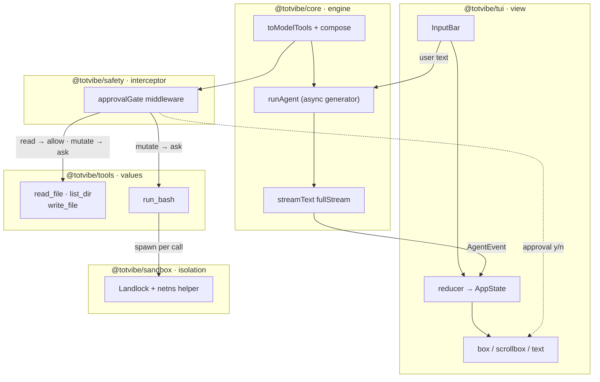

# totvibe

A minimalist terminal coding assistant — a streaming tool-use loop wrapped in an [OpenTUI](https://opentui.com) TUI, on [Bun](https://bun.com), powered by the [Vercel AI SDK](https://ai-sdk.dev) v6.

## Setup

```bash
bun install
bun run build:sandbox   # optional, Linux only — builds the bash sandbox helper (needs Rust)
```

No key needed up front — the connect dialog (below) walks you through it on first run and saves it to `.env`. To skip the dialog, set a key in `.env` (`cp .env.example .env`).

## Run

```bash
bun start
```

Type a request and press Enter. `read_file` and `list_dir` run automatically; `write_file` and `run_bash` ask for approval (`y` to run, `n` to skip). Ctrl+C quits. The status bar shows the active `provider:model`, connection state, and sandbox status.

### Sandboxing (Linux)

`run_bash` runs each command through a Landlock + namespace sandbox helper (`bun run build:sandbox` to build it). The command — and any process it spawns — can only:

- **read** system dirs (`/usr`, `/bin`, `/etc`, `/proc`, …);
- **read/write** the working directory, `/tmp`, and `/dev`;
- reach the **network** only when `TOTVIBE_SANDBOX_NET=inherit` (default is isolated via a network namespace).

File tools (`read_file`/`write_file`/`list_dir`) are validated against the same allow-list, so they can't touch anything `run_bash` can't either. Grant more access for the session with **`/grant <path>`**.

The helper binary is optional: without it, `run_bash` falls back to an unsandboxed shell (marked `(unsandboxed)` in output) and the status bar shows the degraded state. It needs a Linux kernel ≥ 5.13 (Landlock) and unprivileged user namespaces.

### Connect dialog / model switcher

The dialog opens automatically when the active provider has no key, and any time with **Ctrl+P**. It lists every provider with its connection status and selected model:

- **↑ / ↓** — highlight a provider
- **o** — open that provider's API-key page in your browser
- **k** — paste an API key, then Enter to save it (written to `.env` and applied live)
- **m** — edit the model id, then Enter to switch to it
- **Enter** — use the highlighted provider/model
- **Esc** — close (once a provider is connected)

## Configuration

Read from the environment (Bun loads `.env` automatically):

| Variable | Default | Purpose |
|---|---|---|
| `AI_PROVIDER` | `anthropic` | `anthropic`, `openai`, or one of the OpenAI-compatible providers below |
| `MODEL` | per provider | Override the model id |
| `<PROVIDER>_API_KEY` | — | Key for the selected provider (see table below) |
| `AUTO_APPROVE` | unset | Set to `1` to skip approval prompts |
| `TOTVIBE_SANDBOX_NET` | `none` | `inherit` to let sandboxed `run_bash` use the network |
| `TOTVIBE_SANDBOX_BIN` | — | Override the path to the sandbox helper binary |

## Connecting other provider-models

Easiest path is the connect dialog above (**Ctrl+P**) — it opens the key page and saves the key for you. To configure by hand instead: `anthropic` and `openai` are wired natively; the providers below are OpenAI-compatible (via `@ai-sdk/openai-compatible`) — set `AI_PROVIDER`, its key, and optionally a `MODEL`. No code change needed.

| `AI_PROVIDER` | Model | API key env | Base URL | Get a key |
|---|---|---|---|---|
| `qwen` | Alibaba `qwen3.7-max` | `DASHSCOPE_API_KEY` | `https://dashscope-intl.aliyuncs.com/compatible-mode/v1` | [Model Studio](https://www.alibabacloud.com/help/en/model-studio/get-api-key) |
| `glm` | Z.ai `glm-5.1` | `ZAI_API_KEY` | `https://api.z.ai/api/paas/v4` | [Z.ai](https://z.ai/manage-apikey/apikey-list) |
| `kimi` | Moonshot `kimi-k2.6` | `MOONSHOT_API_KEY` | `https://api.moonshot.ai/v1` | [Kimi platform](https://platform.moonshot.ai/console/api-keys) |
| `mimo` | Xiaomi `mimo-v2.5-pro` | `MIMO_API_KEY` | `https://api.xiaomimimo.com/v1` | [MiMo platform](https://platform.xiaomimimo.com) |
| `deepseek` | DeepSeek `deepseek-v4-pro` | `DEEPSEEK_API_KEY` | `https://api.deepseek.com/v1` | [DeepSeek platform](https://platform.deepseek.com/api_keys) |

The model id in the table is the default for that provider; override it with `MODEL` to match the provider's current catalog. Example — DeepSeek:

```bash
AI_PROVIDER=deepseek DEEPSEEK_API_KEY=sk-... MODEL=deepseek-v4-pro bun start
```

Or in `.env`:

```bash
AI_PROVIDER=qwen
DASHSCOPE_API_KEY=sk-...
# MODEL=qwen3.7-max
```

To add another OpenAI-compatible provider, append one entry to the `OPENAI_COMPATIBLE` registry in `packages/tui/src/config.ts`.

## Architecture

A Bun workspaces monorepo. Each package is one architectural concern, so each can evolve without touching the others.

*How a request flows through the packages, and where the extension seams (tools, middleware) plug in.*



| Package | Owns | Extend by |
|---|---|---|
| `@totvibe/core` | The pure `runAgent` async generator, the `AgentEvent` union, `Session` (with `cloneSession` for branching strategies), the value-typed tool registry, and `compose` for middleware | Adding event kinds; wrapping the loop in a reasoning strategy |
| `@totvibe/tools` | The built-in tool *values* (`defineTool`) | Adding a tool — return it from `createBuiltinTools` |
| `@totvibe/safety` | The tool-call interceptor (`approvalGate`) | Composing more middleware (e.g. a classifier) before the executor |
| `@totvibe/sandbox` | The `SandboxState` allow-list + Rust Landlock/namespace helper for `run_bash` | New default paths; per-tool network policy; another OS backend |
| `@totvibe/tui` | The OpenTUI React view + entry + provider config | New components; the view only subscribes to events, it never drives the loop |

The loop is provider-agnostic: the model is injected, so swapping `claude-opus-4-7` for another model or provider is a config change, not a code change.

See [`docs/`](./docs) for the full design and phased extension plan.
